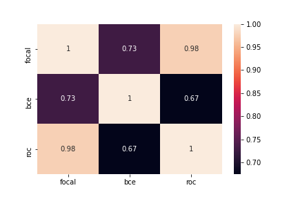

# General overview
After preprocessing used denoising autoencoder for feature engineering. The model was trained the simple neural network with 5 fold stratified cross validation model with focal loss, Wilcoxon Mann Whitney U statistic  and binary cross entropy with stochastic weight averaging and snapshot ensembling. The final predictions was the mean of the predictions of 3 models. 

## cleaning_preprocessing_and adding_columns
### Continuous feature
If skew is greater than 1 then subtract minimum then log of that column, followed by standard scaling.
### Categorical feature
For each column 50 most frequent values use one hot encoding replace the rest by 'Other'

## magic_feature
It can be seen that V307 is the cumulative of Transaction amount for each individual so if we group by n given columns, get cumulative Transaction amount for one group, subtract it with the last value of V307 we should get 0. If we try to minimise this value we colud get columns that can be used to identify one individual. 

## cleaning_preprocessing_and adding_columns_with_id
Same as cleaning_preprocessing_and adding_columns only added magic feature found by process described in magic_feature.

## autoenc_prep_without_id 
Used denoising autoencoder(0.15 swap noise) for feature engineering on the dataset produced by cleaning_preprocessing_and adding_columns

## autoenc_prep_with_id
Used denoising autoencoder for feature engineering on the dataset produced by cleaning_preprocessing_and adding_columns_with_id

## simple_model_with_uid_embeddings
Used a simple neural network of 3 Dense layers followed by Batchnormalization and dropout of 0.3, concatenated it with the magic feature(id) generated after embedding it for 4 dimension and predicted using dense layer of 1 neuron and sigmoid. Trained this model with binary crossentropy and kfold crossvalidation.

## simple_model_roc_auc_with_uid_embeddings
The model used is same as described in simple_model_with_uid_embeddings and trained the network with Wilcoxon-Mann-Whitney U statistic.

## simple_model_focal_loss_with_uid_embeddings
The model used is same as described in simple_model_with_uid_embeddings and trained the network with focal loss.

## simple_model_with_uid_embeddings_swa
Same as described in simple_model_with_uid_embeddings but used StochasticEnsembling and snapsort at a cycle length of 4 for 16 epochs

## simple_model_roc_auc_with_uid_embeddings_swa
Same as described in simple_model_roc_auc_with_uid_embeddings but used StochasticEnsembling and snapsort at a cycle length of 4 for 16 epochs.

## simple_model_focal_loss_with_uid_embeddings_swa
Same as described in simple_model_focal_loss_with_uid_embeddings but used StochasticEnsembling and snapsort at a cycle length of 5 for 20 epochs.

## final_submission
Ensembled the predictions by giving more weight to uncorelated predictions.

## Results

loss  | auc(public)|auc(private)
--- | --- | ---
roc approximation | 0.944 | 0.909
focal loss | 0.948 | 0.916
binary crossentropy | 0.934 | 0.902
roc approximation with swa , weight ensemble and snapsort| 0.951 | 0.916
focal loss with swa , weight ensemble and snapsort| 0.949 | 0.917
binary crossentropy with swa , weight ensemble and snapsort| 0.95 | 0.92

## Ensemble Results

 auc(public)|auc(private)
 --- | ---
 0.952 | 0.921
 
 
 ### Correrelaion among predictions of best models.

## References
- https://www.kaggle.com/c/ieee-fraud-detection/discussion/111476
- https://github.com/tflearn/tflearn/issues/1028
- https://arxiv.org/abs/1704.00109
- https://arxiv.org/abs/1803.05407
